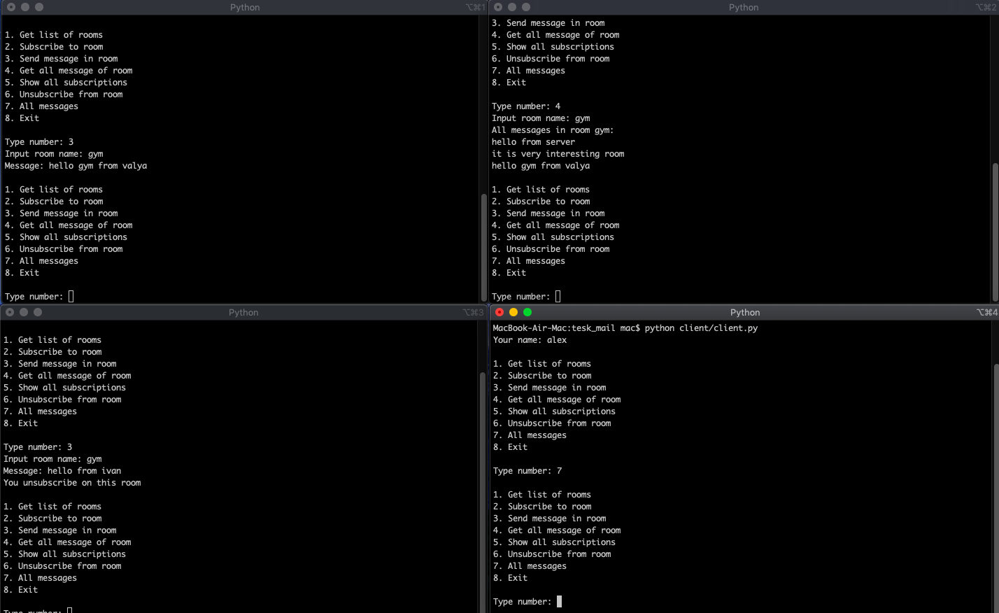

# CLI python app 

Многопользовательское приложение.

### Условие тестового задания 
Создать прототип системы, которая позволит общаться нескольким людям через специальные CLI (command line interface) приложения. Задача требует реализации двух подсистем.

Подсистема #1 — сервер, который позволит создавать "комнаты" (room) для обмена текстовыми сообщениями, длина каждого сообщения не должна превышать 254 байта, кол-во сообщений в room не должно превышать 128 — история “Комнаты” (СУБД не использовать все in-memory).

Подсистема #2 — "клиент", который позволит "публиковать" (publish) сообщения в определенные "комнаты" и, который позволит подписываться (subscribe) на определенные комнаты. ”Комнаты” полностью изолированны друг от друга, т.е. клиенты могут взаимодействовать только с “комнатами”, на которые они были подписаны ранее — список таких комнат задается в файле конфигурации или через CLI.

Подсистемы имеют ряд ограничений и свойств:

- Клиент должен получать историю каждой комнаты при успешном подключение.
- Каждый клиент должен иметь имя, имена должны быть уникальными в рамках “комнаты”. Клиент сообщает свое имя клиент при “подписание” на определеную “комнату”.
- Сервер и клиент — это консольные приложения, которые могут иметь либо файл конфигурации либо все опции передаются через CLI.

Ожидаемый результат:   
1) Исходные код сервера и клиента, выложенный на github.com.   
2) Минимальный набор тестов.


## Настройка и запуск приложения

1. Клонирование репозитория.  
2. Установка виртуального окружения.    
`pip install pipenv`
3. Уствновка зависимостей.  
`pip install -r requirements.txt`
4. Запуск сервера   
`python server.py`
5. Запуск клинта в новом терминале.   
`python client/client.py`

Для остановки сервера ввести "q"


### Возможные действия клиента

Команды:


1. Показать все комнаты.  
	
2. Подписаться на комнату.   
  
3. Послать сообщение в комнату.  
	
4. Посмотреть сообщения комнаты.  
	
5. Посмотреть все комнаты, на которые подписан пользователь.

6. Отписаться от комнаты.  
	
7. Посмотреть все сообщения всех комнат, на которые подписан пользователь.

6. Выйти из системы 


В случае некорректных данных сервер сообщает об ошибке. 
 
Подробное описание формата передачи данных расположено в докстринге к каждому методу.  
### Информация о комнатах представлена в файле конфигурации 


### Возможен запуск нескольких пользователей одновременно в разных терминалах 

Пример 



## Тестирование

Приложение покрыто базовыми тестами на проверку возможности отправки сообщения, подписки, отписки, получения сообщений и комнат.

Для запуска тестов:

```
pytest  
```
